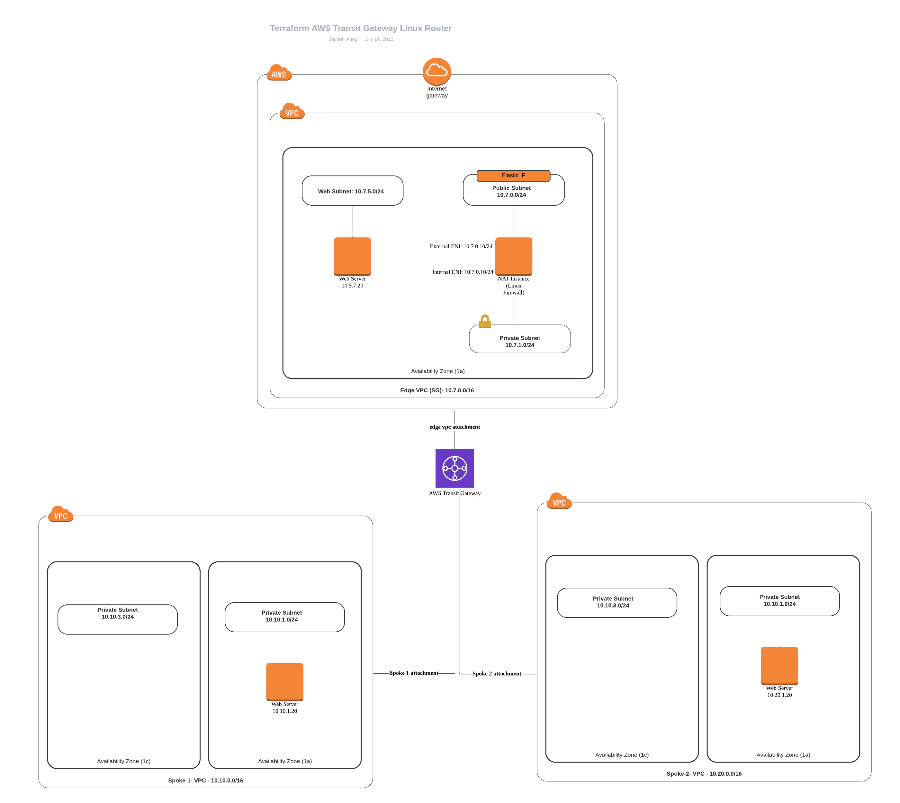

# Terraform - Automating Transit Gateway

In this tutorial, I'll do a step-by-step walk-through of automating an AWS environment which consists of three VPCs, and a Transit Gateway. 

The lab will consist of the the following VPCs.

1. Edge VPC - A NAT instnace (linux firewall), and a web server will be depllyed into this VPC.

2. Spoke VPC 1 - A private web server instance will be deployed into this VPC.

3. Spoke VPC 2 - A private web server instance will be deployed into this VPC.

All three web servers are deployed into private subnets and not directly exposed to the Internet. They are exposed to the Internet via the NAT instance (linux router).




# Prerequisites

1. AWS Account
2. Terraform installed on your laptop. [Follow this guide on Terraform website.](https://www.terraform.io/downloads.html)
3. Git

# Steps

## 1. Clone the git repo
```bash
git clone https://github.com/jaydenaung/AWS-TGW-Lab
```

## 2. Update variables

In the Git directory:

- Edit ```variables.tf``` and update the values accordingly.

## 3. Execute the following commands

In the git directory: 

Execute the following and check everything is in order.

```bash
terraform plan
```
And you can apply.
```bash
echo yes | terraform apply
```
